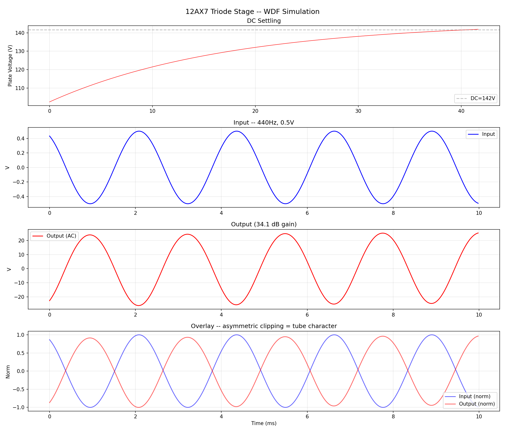
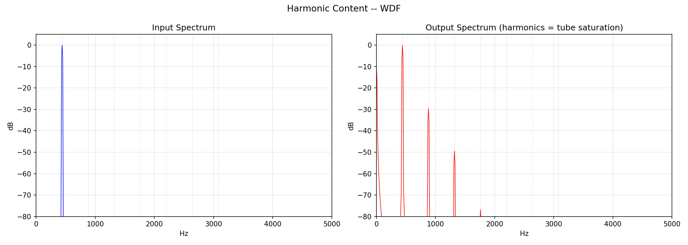
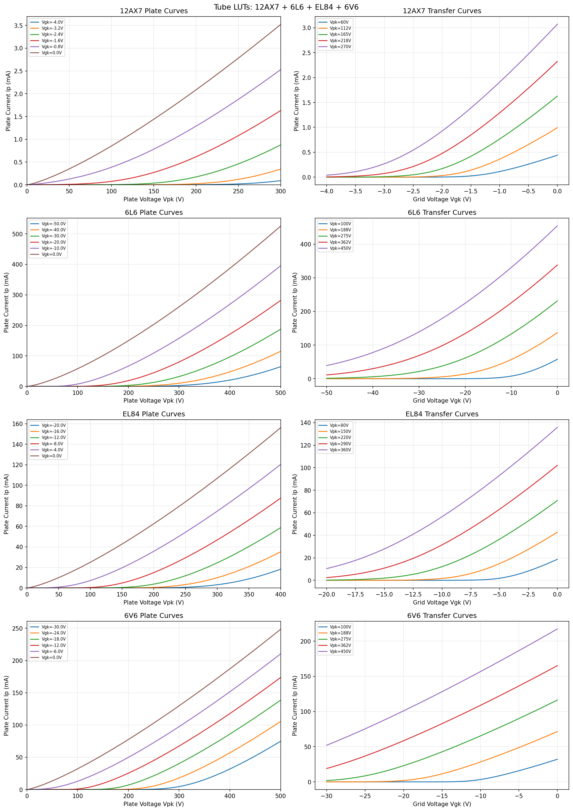
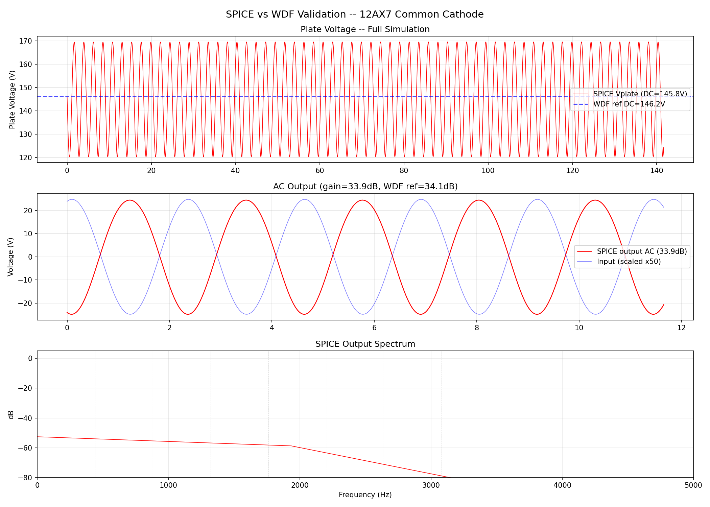
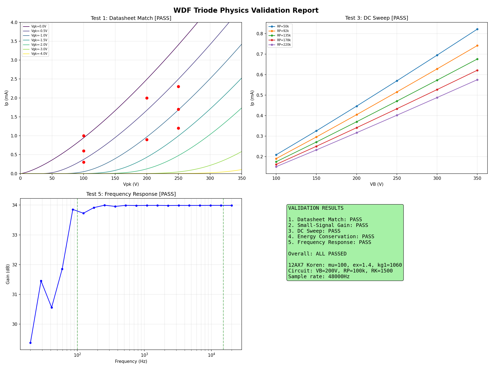
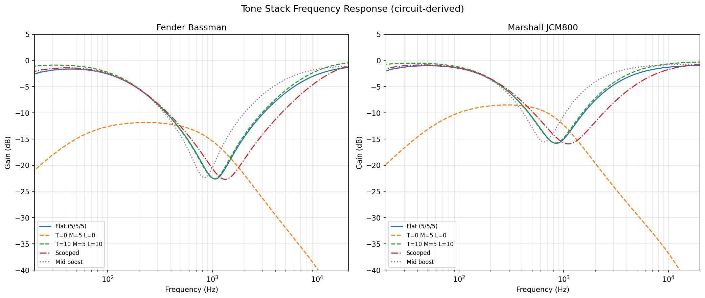
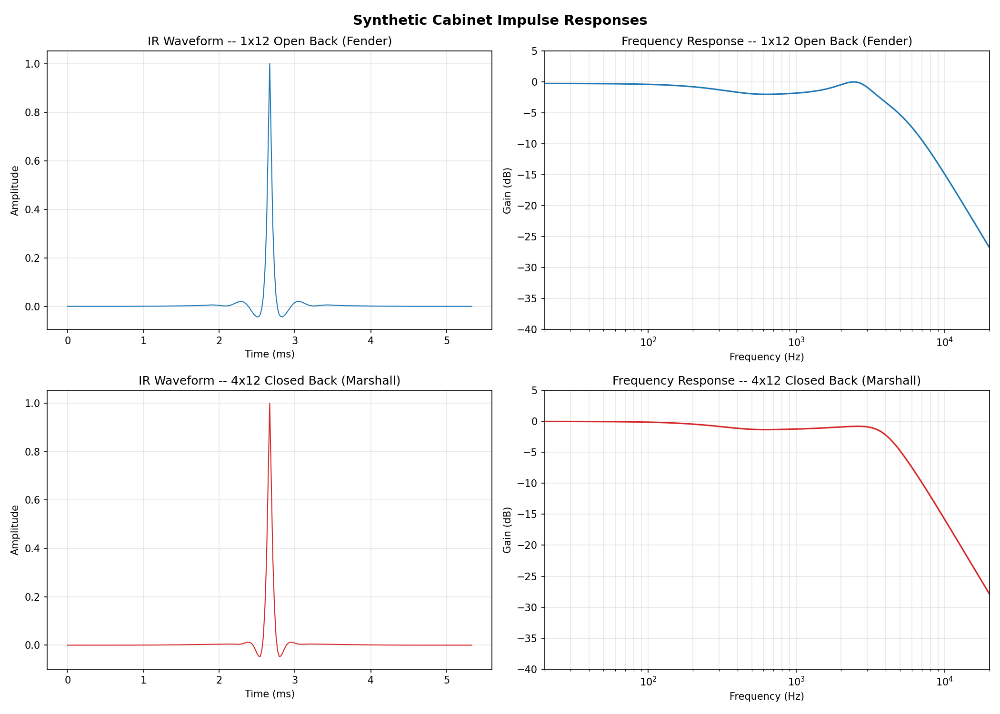
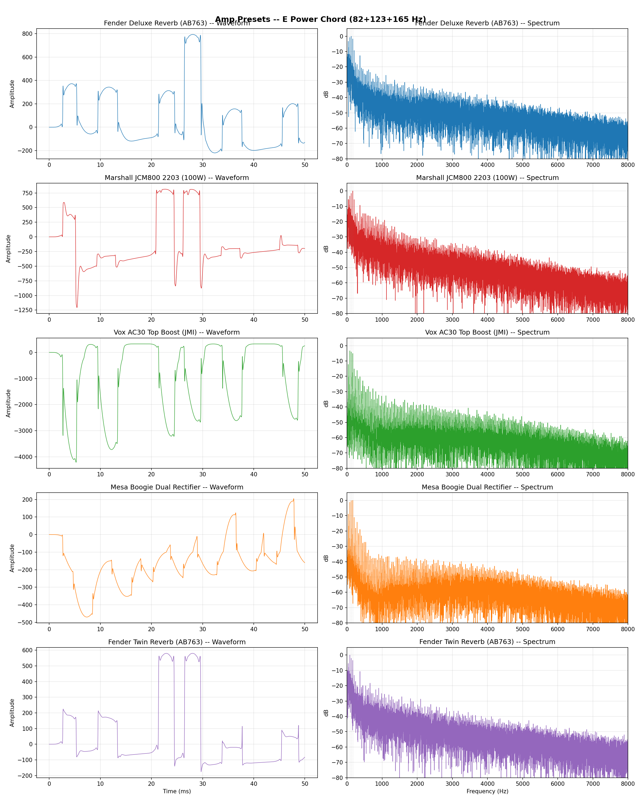

# tangAmp

### Physics-based tube amp emulation on a $25 FPGA

Wave Digital Filter modeling of real vacuum tube circuits on the [Sipeed Tang Nano 20K](https://wiki.sipeed.com/hardware/en/tang/tang-nano-20k/nano-20k.html). Not waveshaping. Not convolution. The actual circuit topology -- series/parallel adaptors, triode nonlinearity solved via Newton-Raphson iteration, 2D lookup tables from the Koren equation.

tangAmp appears to be the only project implementing WDF triode modeling with Newton-Raphson on a consumer FPGA ($25). Commercial products (Kemper, Line 6 Helix, Fractal) use DSP chips.

<p align="center">
  
</p>

---

## Signal Chain

```
Guitar -> PCM1802 ADC -> Noise Gate -> NFB Subtract -> 2x Oversample ->
  Triode Engine (2-stage 12AX7 + 6L6 power amp, Newton-Raphson) ->
  Downsample -> Tone Stack (5 presets) -> Output Transformer ->
  Power Supply Sag -> Cabinet FIR (256-tap, SD card loadable) ->
  NFB Register -> PCM5102 DAC -> Speaker
```

All processing in pure RTL at 48kHz. No soft CPU, no external DRAM. ~313 clock cycles per sample out of 562 available (27MHz clock).

## Features

- **Bypass mode** -- S2 button toggles ADC-to-DAC passthrough for I2S debugging
- **SD card cabinet IR loading** -- Swap SD card to change cabinet, S1 button cycles through IRs, LED[2:4] shows current IR index
- **36 cabinet IRs** -- V30, G12H-75, G12H-150 from Science Amplification and Djammincabs
- **Noise gate** -- Envelope follower with attack/release IIR smoothing
- **Power supply sag** -- B+ droop modeling for touch-sensitive dynamics
- **5 tone stack presets** -- Flat, Scooped, Mid Boost, Bass Heavy, Bright (switchable via input gain control)
- **Variable input gain** -- Ready for external pot control
- **SPI ADC module** -- MCP3008 interface for 4-channel pot reading (~60 LUTs)

## Harmonic Content

A pure 440Hz sine in, rich tube harmonics out -- the asymmetric transfer function generates the characteristic even/odd harmonic series that gives tubes their sound:

<p align="center">
  
</p>

## Tube Models

Plate and transfer curves generated from the Koren equation, curve-fitted to manufacturer datasheet measurements:

<p align="center">
  
</p>

| Tube | mu | Role | Character |
|------|----|------|-----------|
| **12AX7** | 100 | Preamp | High gain, standard guitar amp |
| **12AU7** | 27.5 | Preamp | Lower gain, cleaner |
| **6SL7** | 90.4 | Preamp | Vintage octal |
| **6L6** | 10.1 | Power amp | Fender clean headroom |
| **EL34** | 11.0 | Power amp | Marshall aggressive midrange |
| **300B** | 3.95 | Power amp | Audiophile warm |
| **EL84** | 18.4 | Power amp | Vox chime (fitted to Mullard datasheet, 7.9% error) |
| **6V6** | 10.3 | Power amp | Fender small-amp warmth (fitted to RCA datasheet, 5.7% error) |

## Validation

Four independent solvers confirm the WDF implementation produces correct gain at the correct operating point:

| Solver | Method | Gain | Error |
|--------|--------|------|-------|
| Python WDF | Floating-point, 2x2 Newton with grid current | 34.1 dB | reference |
| Verilog WDF | Q16.16 fixed-point, 2x2 Newton | 34.1 dB | 9.9% RMS |
| ngspice | SPICE nodal analysis | 34.3 dB | 0.21 dB |
| chowdsp_wdf C++ | Established WDF library | 34.1 dB | 0.18% |

The 9.9% Verilog-Python RMS error comes from 128x128 LUT quantization of fitted Koren constants. I2S full-chain simulation validated separately (51.5 dB gain, AC signal passes through correctly). Two bugs found and fixed via simulation: noise gate threshold and HPF DC leak.

<p align="center">
  
</p>

Physics validation passes all 5 tests -- datasheet Ip curve match, analytical small-signal gain, DC sweep (150 operating points), energy conservation (<0.001% error), and flat frequency response:

<p align="center">
  
</p>

## Tone Stack

Circuit-derived biquad IIR filters matching the Fender Bassman and Marshall JCM800 tone stack topologies:

<p align="center">
  
</p>

## Cabinet Impulse Responses

256-tap FIR convolution with real measured Celestion IRs (V30, G12H-75, G12H-150). 36 IRs loadable from SD card at boot time:

<p align="center">
  
</p>

## Amp Presets

Five amp voicings derived from real schematics (Fender Deluxe, Marshall JCM800, Vox AC30, Mesa Dual Rectifier, Fender Twin) -- each with distinct per-stage Rp/Rk/Ck values, clipping character, and spectral signature:

<p align="center">
  
</p>

## FPGA Resource Usage

Gowin GW2AR-LV18QN88C8/I7 on Tang Nano 20K:

| Resource | Used | Available | |
|----------|-----:|----------:|---|
| **LUT** | 17,063 | 20,736 | `#################---` 83% |
| **Registers** | 1,303 | 15,750 | `##------------------` 9% |
| **BSRAM** | 39 | 46 | `#################---` 85% |
| **DSP** | 21.5 | 24 | `##################--` 90% |

Q16.16 signed fixed-point throughout. 48kHz sample rate. 27MHz clock.

## Hardware BOM

| Component | Part | Cost |
|-----------|------|-----:|
| FPGA | Sipeed Tang Nano 20K (Gowin GW2AR-18) | ~$25 |
| ADC | PCM1802 / PCM1808 (24-bit I2S) | ~$5 |
| DAC | PCM5102 (32-bit I2S) | ~$5 |
| SD Card | Any MicroSD (for cabinet IRs) | ~$3 |
| | **Total** | **~$38** |

## Project Structure

```
rtl/           Synthesizable Verilog (triode, tone stack, cabinet, I2S, top)
fpga/          Synthesis scripts, constraints, testbenches
sim/           Python simulation, validation, demo generation
data/          Hex LUTs (tube curves) and cabinet IRs
wav_irs/       Raw WAV cabinet impulse responses
demos/         Generated audio, plots, validation images
docs/          Plans, specs, reference documents
ui/            React dashboard
```

## Quick Start

```bash
# Python simulation + validation (from sim/)
cd sim
python quick_test.py              # smoke test (<1s)
python validate_wdf.py            # Verilog vs Python cross-validation
python validate_physics.py        # physics tests (5 checks)
python full_chain_demo.py         # generate demo audio

# Regenerate LUTs and cabinet IRs (outputs to data/)
python tube_lut_gen.py
python process_cab_irs.py         # process WAV IRs from wav_irs/ -> data/

# Verilog simulation (from project root, requires Icarus Verilog)
iverilog -g2012 -o wdf_sim_v fpga/wdf_triode_wdf_tb.v rtl/wdf_triode_wdf.v && vvp wdf_sim_v

# Full chain simulation
iverilog -g2012 -o sim_full fpga/tangamp_fullchain_tb.v fpga/tangamp_selftest.v \
  rtl/triode_engine.v rtl/tone_stack_iir.v rtl/cabinet_fir.v rtl/wdf_triode_wdf.v && vvp sim_full

# FPGA build (requires Gowin EDA)
cd fpga && gw_sh synthesize.tcl

# Flash bitstream
programmer_cli --device GW2AR-18C --run 2 --fsFile fpga/impl/pnr/project.fs
```

The self-test bitstream (`fpga/tangamp_selftest.v`) generates an internal sine wave and drives VU meter LEDs -- no external hardware needed to verify the FPGA works.

## WDF Architecture

The triode is a 3-port nonlinear element at the root of a Wave Digital Filter binary tree. Wave variables (incident/reflected voltage pairs) propagate through the tree, and the triode is solved via 2D LUT + Newton-Raphson iteration:

```
                +-------------+
                |  TRIODE ROOT |
                |  (Ip, Ig LUT)|
                +--+----+----+-+
                   |    |    |
            plate  |  grid |  cathode
                   |    |    |
              +----++ ++-+--+ ++-------+
              |Series| |Series| |Parallel|
              +-+--+-+ +-+--++ +-+-----++
                |  |    |   |   |      |
               Rp  V_B  Cin  Rg  Rk    Ck
              100k 200V 22nF 1M 1.5k  22uF
```

Each Newton-Raphson iteration:
1. Extract port voltages from incident waves
2. Look up Ip and dIp/dVgk, dIp/dVpk from 256x256 BRAM LUTs
3. Compute 2x2 Jacobian correction (with grid current via Langmuir-Child)
4. Update reflected waves

Two iterations per sample. ~16 clock cycles per triode stage.

## Current Status

**Done:**
- Grid current modeling (2x2 Newton with Langmuir-Child, K=0.0002 from BSPICE data)
- Interstage coupling (per-stage Rp/Rk/Ck from real schematics)
- Output transformer + negative feedback loop (validated)
- 5 amp presets from real circuit values
- SD card cabinet IR loading with button cycling

**Known limitations:**
- Hardware not yet tested (PCM boards arriving, bring-up imminent)
- 20K FPGA at 83% LUT capacity -- 138K FPGA available for future expansion
- J11=2 constant approximation in Newton solver (proper Jacobian needs more BSRAM)
- 9.9% Verilog-Python error from 128x128 LUT quantization of fitted constants

## References

- K. Werner, *"Virtual Analog Modeling of Audio Circuitry Using Wave Digital Filters,"* Stanford PhD thesis, 2016. [PDF](https://purl.stanford.edu/jy057cz8322)
- J. Pakarinen & M. Karjalainen, *"Enhanced Wave Digital Triode Model,"* IEEE Trans., 2010. [Link](https://ieeexplore.ieee.org/abstract/document/5272282/)
- S. D'Angelo et al., *"Wave Digital Filter Adaptors for Arbitrary Topologies,"* 2019. [Link](https://link.springer.com/article/10.1007/s00034-019-01331-7)
- Y. Zhao & S. Hsieh, *"FPGA Implementation of Wave Digital Filters,"* IEEE, 2023. [Link](https://ieeexplore.ieee.org/document/10322655)
- J. Chowdhury, *"chowdsp_wdf,"* 2022. [Paper](https://arxiv.org/abs/2210.12554) / [Code](https://github.com/Chowdhury-DSP/chowdsp_wdf)
- R. Zhang & J. Smith, *"Modified Blockwise Method for WDF,"* DAFx, 2018
- F. Dempwolf & U. Zolzer, *"Physically-Motivated Triode Model,"* DAFx, 2011
- J. Chowdhury, *"ADAA in Wave Digital Filters,"* DAFx, 2020
- A. Bernardini et al., *"Extended Fixed-Point Solvers for Nonlinear WDFs,"* IEEE TCAS-I, 2024
- A. Blasie, *"FPGA Implementation of Guitar Effects,"* RIT MS Thesis, 2020

## License

MIT
